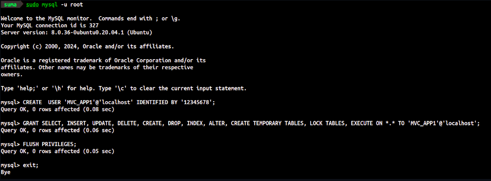
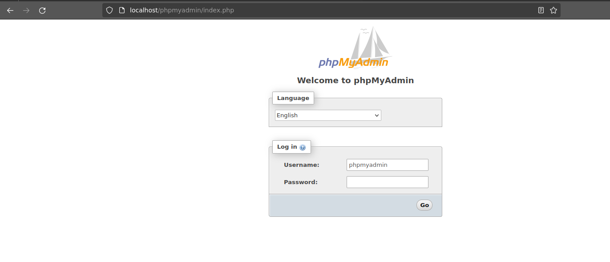
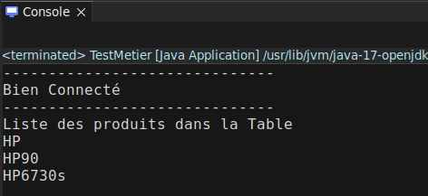
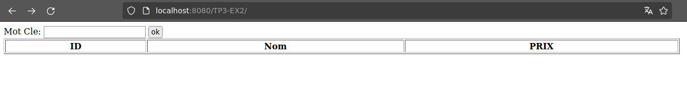
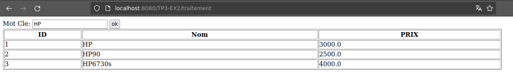
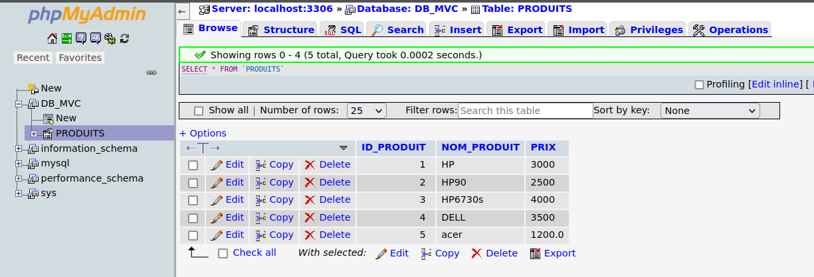

<h4>TP 4 Compte Rendu Partie 1</h4>

<h5>Contexte :</h5>
    <p>Le But de ce TP est : réaliser une application CRUD de gestion des produits.</p>

<h6>Tâches à réaliser :</h6>
    <ul>
        <li>Création de la base des données et la table du projet.</li>
        <li>Ecriture des servlets de traitement des requêtes</li>
        <li>Ecriture des Bean mappant les données</li>
        <li>Ecriture des vues JSP</li>
    </ul>

<h6>Environnement technique :</h6>
    <ul>
        <li>Base des données : MySQL</li>
        <li>Serveur Web : Apache Tomcat</li>
        <li>Technologie Java EE : Servlets ; JSP ; JSTL ; EL</li>
        <li>IDE (Eclipse ou autre)</li>
    </ul>

<h6>Recommandations :</h6>
    <ul>
        <li>Respecter le design pattern MVC ;</li>
        <li>Ecriture du code source conformément aux recommandations de Java.</li>
    </ul>

#### Description du TP :

##### Question 1 :

Créer une base de données nommée « DB_MVC » en mysql, et qui contient une
seule table «PRODUITS», cette dernière contiendra 4 colonnes :

- ID_PRODUIT de type INT (clé primaire).
- NOM_PRODUIT de type VARCHAR et de taille 25.
- PRIX de type double.

 

[http://localhost/phpmyadmin/index.php](http://localhost/phpmyadmin/index.php)

 

```SQL
CREATE DATABASE IF NOT EXISTS DB_MVC;
USE DB_MVC;
DROP TABLE IF EXISTS PRODUITS;
CREATE TABLE PRODUITS (
	ID_PRODUIT INTEGER PRIMARY KEY AUTO_INCREMENT,
	NOM_PRODUIT VARCHAR(255),
	PRIX VARCHAR(255)
);
```

##### Question 2:

Insérer 4 enregistrements respectivement (HP/3000, HP90/2500, HP6730s/4000,
DELL/3500)

```sql
insert into PRODUITS VALUES
(1, 'HP', 3000),
(2, 'HP90', 2500),
(3, 'HP6730s', 4000),
(4, 'DELL', 3500);
```

##### Question 3:

Créer un nouveau dynamic web project nommé «TP3-EX2»

### I- La couche Metier

#### Question 4 :

Créer, dans un package «**metier**», un java Bean « **Produit** » : une classe
Serialisable contenant les trois propriétés, et générer un constructeur public sans
argument et les **getters** et les **setters**.

```java
package metier;

import java.io.Serializable;

public class Produit implements Serializable{
	private static final long serialVersionUID = 1L;
	private int idProduit;
	private String nomProduit;
	private double prix;

	public void setIdProduit(int idProduit) {
		this.idProduit = idProduit;
	}

	public String getNomProduit() {
		return nomProduit;
	}
	public void setNomProduit(String nomProduit) {
		this.nomProduit = nomProduit;
	}

	public double getPrix() {
		return prix;
	}
	public void setPrix(double prix) {
		this.prix = prix;
	}

	public Produit(String nomProduit, double prix) {
		super();
		this.nomProduit = nomProduit;
		this.prix = prix;
	}
	public Produit() {
		super();
	}
}
```

#### Question 5 :

5. Créer la classe « SingletonConnection » pour établir la connexion avec la base de
   données contenant :

- Une variable static de type connection
- La methode (class.forName) pour charger le pilote jdbc
- Etablir la connection : connection=Drivermanager.getconnection("jdbc :mysql://localhost :3306/DB_MVC", "root","") ;
- La methode **getconnection**.

```java
package metier;

import java.sql.Connection;
import java.sql.DriverManager;
import java.sql.SQLException;

public class SingletonConnection {
	private static Connection con = null;
	private static String jdbc_url = "jdbc:mysql://localhost:3306/DB_MVC";
	private static String userName = "MVC_APP1";
	private static String mdp = "12345678";

	public static void main(String[] args) throws SQLException, ClassNotFoundException {
			Class.forName("com.mysql.cj.jdbc.Driver");
			con = DriverManager.getConnection(jdbc_url, userName, mdp);
			if (con != null) {
				System.out.println("------------------------------");
				System.out.println("Bien Connecté");
				System.out.println("------------------------------");
			}
	}
	public Connection getConnection() {
	  return SingletonConnection.con;
	}
}
```

ProduitModele :

```java
package metier;

import java.util.ArrayList;
import java.util.List;

public class ProduitModele {
	private String motCle;
	private List<Produit> produits = new ArrayList<>();

	public String getMotCle() {
		return motCle;
	}
	public void setMotCle(String motCle) {
		this.motCle = motCle;
	}
	public List<Produit> getProduits(){
		return produits;
	}
	public void setProduits(List<Produit> produits) {
		this.produits = produits;
	}
}

```

#### Question 6:

Création d'une interface IMetierCatalogue dans laquelle on va déclarer les méthodes suivantes :
Une méthode qui permet de retourner la liste des produit à partir d'un mot clé.

```java
package metier;

import java.util.List;

public interface IMetierCatalogue {

	public List<Produit> getProduitsParMC(String mc);
	public void addProduit(Produit p);
}

```

#### Question 7 :

suite à la question précédente maintenant on va créer une classe qui implémente cette interface
"MetierImpl" qui va implémenter l'interface "IMetierCatalogue"

- établir la connexion avec BDD/
- créer et exécuter la requête SQL pour chercher un produit par mot clé.

```java
package metier;

import java.sql.Connection;
import java.sql.PreparedStatement;
import java.sql.ResultSet;
import java.sql.SQLException;
import java.util.ArrayList;
import java.util.List;

public class MetierImpl implements IMetierCatalogue{
	@Override
	public List<Produit> getProduitsParMC(String mc) {
		List <Produit> prods = new ArrayList<Produit>();
		Connection conn = SingletonConnection.getConnection();
		try {
			PreparedStatement ps = conn.prepareStatement("SELECT * FROM PRODUITS WHERE NOM_PRODUIT LIKE ?");
			ps.setString(1, "%"+ mc + "%");
			ResultSet rs = ps.executeQuery();
			while (rs.next()) {
				Produit p = new Produit();
				p.setIdProduit(rs.getInt("ID_PRODUIT"));
				p.setNomProduit(rs.getString("NOM_PRODUIT"));
				p.setPrix(rs.getDouble("PRIX"));
				prods.add(p);
			}
		} catch (SQLException e) {
			e.printStackTrace();
		}
		return prods;
	}
	@Override
	public void addProduit(Produit p) {

	}
}
```

#### Question 8 :

Une classe TestMetier pour tester MetierImpl :

```java
package metier;

import java.util.List;

public class TestMetier {
	public static void main(String[] args) {
		MetierImpl metier = new MetierImpl();
		List<Produit> prods = metier.getProduitsParMC("HP");
		System.out.println("Liste des produits dans la Table");
		for (Produit P: prods) {
			System.out.println(P.getNomProduit());
		}
	}
}
```

#### Question 9 :

jusqu'au maintenant lorsqu'on exécute la fonction principale main on obtient le résultat dans le console on vérifie que le sqlconnector est bien placé dans le lib :

 

### II La couche Web :

#### Question 1:

La création d'une classe ProduitModele où on va stocker les données saisies et les résultats affiché (deux propriétés : mot clé et liste-produits )

```java
package web;

import java.util.ArrayList;
import java.util.List;

public class ProduitModele {
	private String motCle;
	private List<Produit> produits = new ArrayList<>();

	public String getMotCle() {
		return motCle;
	}
	public void setMotCle(String motCle) {
		this.motCle = motCle;
	}
	public List<Produit> getProduits(){
		return produits;
	}
	public void setProduits(List<Produit> produits) {
		this.produits = produits;
	}
}
```

#### Question 2 :

La création du Controlleur lorsqu'on parle dans le cadre de l'architecture MVC :

La création d'une servlet "ControleurServlet" qui va lire les données de la requête et forwarder l'affichage du résultat vers la page **ProduitView.jsp**

```java
package web;

import metier.Produit;

import java.io.IOException;
import java.util.List;

import javax.servlet.ServletException;
import javax.servlet.annotation.WebServlet;
import javax.servlet.http.HttpServlet;
import javax.servlet.http.HttpServletRequest;
import javax.servlet.http.HttpServletResponse;

import metier.IMetierCatalogue;
import metier.MetierImpl;

@WebServlet("/traitement")
public class ControleurServlet extends HttpServlet {
	private static final long serialVersionUID = 1L;
    private IMetierCatalogue metier;
    public ControleurServlet() {
        super();
    }
    public void init() throws ServletException{
    	metier = new MetierImpl();
    }
    @Override
	protected void doPost(HttpServletRequest request, HttpServletResponse response) throws ServletException, IOException {
    	String mc = request.getParameter("motCle");
    	ProduitModele mod = new ProduitModele();
    	mod.setMotCle(mc);
    	List<Produit> prods = metier.getProduitsParMC(mc);
    	mod.setProduits(prods);

    	request.setAttribute("modele", mod);
    	request.getRequestDispatcher("ProduitView.jsp").forward(request, response);
    }

}
```

#### Question 3:

Création de la vue **ProduitView.jsp** qui va afficher les produits qui contient le mot clé dans le nom sous forme d'un tableau :

pour assurer le bon fonctionnement puisque dans cette partie on a utilisé le JSTL on va ajouter sous lib dossier :

```java
<%@ page language="java" contentType="text/html;
charset=UTF-8" pageEncoding="UTF-8"%>
<%@taglib uri="http://java.sun.com/jsp/jstl/core" prefix="c" %>
<!DOCTYPE html PUBLIC "-//W3C//DTD HTML
4.01 Transitional//EN"
"http://www.w3.org/TR/html4/loose.dtd">
<html>
<head>
<meta http-equiv="Content-Type" content="text/html; charset=UTF-8">
<title>MVC_APP1</title>
</head>
<form action="traitement" method="post">
Mot Cle: <input type="text" name="motCle"
value="${modele.motCle}">
<input type="submit" value="ok">
</form>
<table border="1" width="80%">
<tr>
<th>ID</th><th>Nom</th><th>PRIX</th>
</tr>
<c:forEach items="${modele.produits}" var="p">
<tr>
<td>${p.idProduit}</td>
<td>${p.nomProduit}</td>
<td>${p.prix}</td>
</tr>
</c:forEach>
</table>
</body>
</html>
```

lorsqu'on exécute l'application dans le serveur on obtient le résultat suivant :

 

on cherche les produits de HP :

 

la structure de notre projet :

```bash
├── build
│   └── classes
│       ├── metier
│       │   ├── IMetierCatalogue.class
│       │   ├── MetierImpl.class
│       │   ├── Produit.class
│       │   ├── SingletonConnection.class
│       │   └── TestMetier.class
│       └── web
│           ├── ControleurServlet.class
│           └── ProduitModele.class
└── src
    └── main
        ├── java
        │   ├── metier
        │   │   ├── IMetierCatalogue.java
        │   │   ├── MetierImpl.java
        │   │   ├── Produit.java
        │   │   ├── SingletonConnection.java
        │   │   └── TestMetier.java
        │   └── web
        │       ├── ControleurServlet.java
        │       └── ProduitModele.java
        └── webapp
            ├── META-INF
            │   └── MANIFEST.MF
            ├── ProduitView.jsp
            └── WEB-INF
                └── lib
                    ├── jstl-impl-1.2.jar
                    ├── jstl-standard.jar
                    └── mysql-connector-j-8.3.0.jar

```

### Exercice II:

puisque la méthode rechercher est opérationnel on passe maintenant à l'implémentation des autres méthodes pour

- Ajouter : Ajout d'un produit

```java
package web;

import metier.Produit;

import java.io.IOException;
import java.util.List;

import javax.servlet.ServletException;
import javax.servlet.annotation.WebServlet;
import javax.servlet.http.HttpServlet;
import javax.servlet.http.HttpServletRequest;
import javax.servlet.http.HttpServletResponse;

import metier.IMetierCatalogue;
import metier.MetierImpl;

@WebServlet("/traitement")
public class ControleurServlet extends HttpServlet {
	private static final long serialVersionUID = 1L;
    private IMetierCatalogue metier;

    public ControleurServlet() {
        super();
    }

    public void init() throws ServletException{
    	metier = new MetierImpl();
    }
    @Override
	protected void doPost(HttpServletRequest request, HttpServletResponse response) throws ServletException, IOException {
    	String mc = request.getParameter("motCle");
    	ProduitModele mod = new ProduitModele();
    	MetierImpl imp = new MetierImpl();
    	Produit Prod = new Produit();

    	mod.setMotCle(mc);
    	List<Produit> prods = metier.getProduitsParMC(mc);
    	mod.setProduits(prods);

    	request.setAttribute("modele", mod);

        String NomProduit = request.getParameter("Nom_Prod");
        Prod.setNomProduit(NomProduit);
        double price = Double.parseDouble(request.getParameter("Prix_Prod"));
        Prod.setPrix(price);
        imp.addProduit(Prod);

        request.getRequestDispatcher("ProduitAjout.jsp").forward(request, response);
    }
}

```

pour l'implémentation de la méthode dans la classe _MetierImpl_

```java
	@Override
	public void addProduit(Produit Prod) {
		Connection conn = SingletonConnection.getConnection();
        try {
            String query = "INSERT INTO PRODUITS (ID_PRODUIT, NOM_PRODUIT, PRIX) VALUES (?, ?, ?)";
            PreparedStatement stmt = conn.prepareStatement(query);
            stmt.setInt(1, Prod.getIdProduit());
            stmt.setString(2, Prod.getNomProduit());
            stmt.setDouble(3, Prod.getPrix());
            int rowsAffected = stmt.executeUpdate();
            System.out.println(rowsAffected + " row(s) affected");
        }
		catch(SQLException e) {
			e.printStackTrace();
		}
	}
```

 

il est mise à jour dans la table :

 
